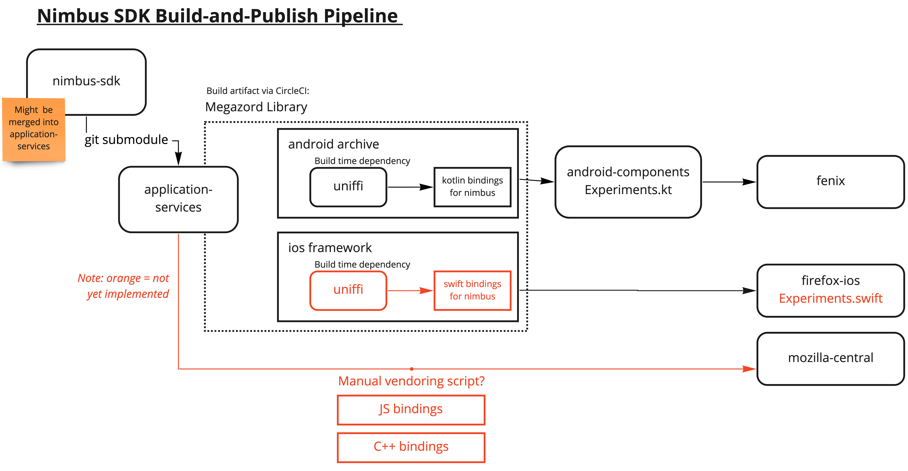

## Application Services Build and Publish Pipeline

This document provides an overview of the build-and-publish pipeline used to make our work
in this repo available to consuming applications. It's intended both to document the pipeline
for development and maintenance purposes, and to serve as a basic analysis of the integrity
protections that it offers (so you'll notice there are notes and open questions in place where
we haven't fully hashed out all those details).

The key points:

* We use "stable" [Rust](https://www.rust-lang.org/). CI is pinned to whatever version is currently used on mozilla-central
  to help with vendoring into that repository. You should check what current values are
  specified for [CircleCI](../.circleci/config.yml) and for [TaskCluster](../taskcluster/scripts/toolchain/rustup-setup.sh)
* We use [Cargo](https://github.com/rust-lang/cargo) for building and testing the core Rust code in isolation,
  [Gradle](https://gradle.org/) with [rust-android-gradle](https://github.com/mozilla/rust-android-gradle)
  for combining Rust and Kotlin code into Android components and running tests against them,
  and [Carthage](https://github.com/Carthage/Carthage) driving [XCode](../xconfig)
  for combining Rust and Swift code into iOS components.
* [TaskCluster](../automation/taskcluster/README.md) runs on every pull-request, release,
  and push to main, to ensure Android artifacts build correctly and to execute their
  tests via gradle.
* [CircleCI](../.circleci/config.yml) runs on every branch, pull-request (including forks), and release,
  to execute lint checks and automated tests at the Rust and Swift level.
* Releases are made by [manually creating a new release](./howtos/cut-a-new-release.md) via github,
  which triggers various CI jobs:
    * [CircleCI](../.circleci/config.yml) is used to build an iOS binary release on every release,
      and publish it as a GitHub release artifact.
    * [TaskCluster](../automation/taskcluster/README.md) is used to:
        * Build an Android binary release.
        * Upload Android library symbols to [Socorro](https://wiki.mozilla.org/Socorro).
        * Publish it to the [maven.mozilla.org](https://maven.mozilla.org).
* Notifications about build failures are sent to a mailing list at
  [a-s-ci-failures@mozilla.com](https://groups.google.com/a/mozilla.com/forum/#!forum/a-s-ci-failures)
* Our Taskcluster implementation is almost entirely maintained by the Release Engineering team.
  The proper way to contact them in case of emergency or for new developments is to ask on the `#releaseduty-mobile` Slack channel.
  Our main point of contact is @mihai.

For Android consumers these are the steps by which Application Services code becomes available,
and the integrity-protection mechanisms that apply at each step:

1. Code is developed in branches and lands on `main` via pull request.
    * GitHub branch protection prevents code being pushed to `main` without review.
    * CircleCI and TaskCluster run automated tests against the code, but do not have
      the ability to push modified code back to GitHub thanks to the above branch protection.
      * TaskCluster jobs do not run against PRs opened by the general public,
        only for PRs from repo collaborators.
    * Contra the [github org security guidelines](https://wiki.mozilla.org/GitHub/Repository_Security),
      signing of individual commits is encouraged but is **not required**. Our experience in practice
      has been that this adds friction for contributors without sufficient tangible benefit.
2. Developers manually create a release from latest `main`.
    * The ability to create new releases is managed entirely via github's permission model.
    * TODO: the [github org security guidelines](https://wiki.mozilla.org/GitHub/Repository_Security)
      recommend signing tags, and auditing all included commits as part of the release process.
      We should consider some tooling to support this. I don't think there's any way to force
      githib to only accept signed releases in the same way it can enforce signed commits.
3. TaskCluster checks out the release tag, builds it for all target platforms, and runs automated tests.
    * These tasks run in a pre-built docker image, helping assure integrity of the build environment.
    * TODO: could this step check for signed tags as an additional integrity measure?
5. TaskCluster uploads symbols to Socorro.
    * The access token for this is currently tied to @eoger's LDAP account.
5. TaskCluster uploads built artifacts to maven.mozilla.org
    * Secret key for uploading to maven is provisioned via TaskCluster,
      guarded by a scope that's only available to this task.
    * TODO: could a malicious dev dependency from step (3) influence the build environment here?
    * TODO: talk about how TC's "chain of trust" might be useful here.
6. Consumers fetch the published artifacts from maven.mozilla.org.

For iOS consumers the corresponding steps are:

1. Code is developed in branches and lands on `main` via pull request, as above.
2. Developers manually create a release from latest `main`, as above.
3. CircleCI checks out the release tag, builds it, and runs automated tests.
    * TODO: These tasks bootstrap their build environment by fetching software over https.
      could we do more to ensure the integrity of the build environment?
    * TODO: could this step check for signed tags as an additional integrity measure?
    * TODO: can we prevent these steps from being able to see the tokens used
      for publishing in subsequent steps?
4. CircleCI runs Carthage to assemble a zipfile of built frameworks.
    * TODO: could a malicious dev dependency from step (3) influence the build environment here?
5. CircleCI uses [dpl](https://github.com/travis-ci/dpl) to publish to GitHub as a release artifact.
    * CircleCI config contains a github token (owned by the @appsvc-moz GitHub account) with appropriate permissions to add release artifacts.
6. Consumers fetch the published artifacts from GitHub during their build process,
   using Carthage.

It's worth noting that Carthage will *prefer* to use the built binary artifacts,
but will happily check out the tag and compile from source itself if such artifacts
are not available.

This is a diagram of the pipeline as it exists (and is planned) for the Nimbus SDK, one of the
libraries in Application Services:
(Source: https://miro.com/app/board/o9J_lWx3jhY=/)

